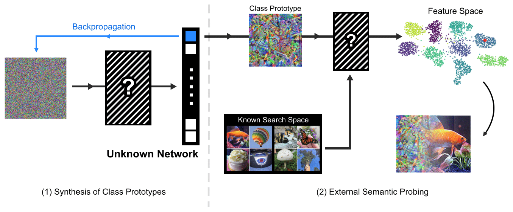
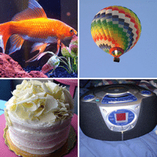
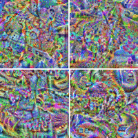
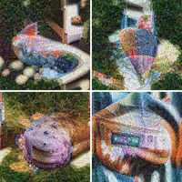

# What Neural Networks Know: Uncovering Latent Knowledge in Deep Vision Models
<p align="center">

</p>

Official implementation of the paper **"What Neural Networks Know: Uncovering Latent Knowledge in Deep Vision Models"**.  
We develop **PEEK**, a fully data-free probing method that uses logit-maximization–based prototype synthesis to generate class-level representations, which are then compared in feature space to infer latent semantic knowledge.


## Overview
An integral part of the paper is the generation of class prototypes. We use DeepDream-based prototypes for neural probing and we employ DeepInversion prototypes to construct synthetic reference sets that significantly strengthen OOD detection.


### DeepDream
DeepDream synthesizes an image $\hat{x}$ by maximizing a chosen network activation (e.g., a class logit) while suppressing high-frequency artifacts:

$$
\max_{\hat{x}}\ L(\hat{x}) - R(\hat{x}), 
$$

where $R(\hat{x})$ denotes a total-variation–based regularizer that suppresses high-frequency patterns and stabilizes the optimization.

The resulting images lack discernible visual features, yet the network still interprets them in a way that preserves their underlying semantic meaning.

<p align="center">
  
  
</p>


### DeepInversion
DeepInversion extends DeepDream by enforcing that synthesized images match the feature statistics stored in batch-normalization layers, encouraging realistic intermediate activations:

$$
R_{\text{feature}}(\hat{x}) =
\sum_{l}
\left\|
\mu_l(\hat{x}) - \mathbb{E}[\mu_l(x)]
\right\|_2^2
+
\left\|
\sigma_l^2(\hat{x}) - \mathbb{E}[\sigma_l^2(x)]
\right\|_2^2 .
$$

<p align="center">
  
  
</p>


## Installation

```bash
pip install -r requirements.txt
```

## Usage

### Module Overview

The `wnnnk_core` module provides tools for prototype synthesis and out-of-distribution detection.

### Deep Dream

Deep Dream synthesizes images by maximizing target neuron activations while applying regularization penalties to suppress artifacts.

**Basic Usage:**
```python
from wnnnk_core.deep_dream import Dreamer, Penalizer
import torch
import torchvision.models as models

# Load a pretrained model
model = models.resnet50(pretrained=True)
target_layer = model.fc  # Choose layer to maximize

# Configure regularization
penalizer = Penalizer(
    total_variation_weight=1.0,
    l1_edge_weight=1.0,
    l2_pixel_weight=1.0
)

# Initialize the dreamer
dreamer = Dreamer(
    model=model,
    model_layer=target_layer,
    penalizer=penalizer,
    device=device
)

# Generate a prototype for class 243 (bull mastiff)
base_image = torch.rand(1, 3, 224, 224)
dream_image, loss_history = dreamer.dream_neuron(
    base_image=base_image,
    target_neuron=243,
    iterations=500,
    lr=0.05
)
```

**Batch Processing:**
```python
# Generate prototypes for multiple classes at once
base_images = torch.rand(10, 3, 224, 224)
target_classes = torch.tensor([0, 1, 2, 3, 4, 5, 6, 7, 8, 9])

dream_images, loss_histories = dreamer.dream_batch(
    base_images=base_images,
    target_neurons=target_classes,
    iterations=500,
    lr=0.05,
    clamp_range=(0.0, 1.0)
)
```

### Deep Inversion

Deep Inversion extends Deep Dream by matching batch normalization statistics to generate more realistic prototypes.

**Basic Usage:**
```python
from wnnnk_core.deep_inversion import deep_inversion
import torchvision.models as models

# Load a pretrained model with BatchNorm layers
model = models.resnet50(pretrained=True)

# Generate prototypes for a specific class
synthetic_images = deep_inversion(
    net=model,
    bs=10,                      # Number of images to generate
    iterations=2000,            # Optimization iterations
    lr=0.2,                     # Learning rate
    r_feature=0.05,             # BN statistics matching weight
    tv_l1=0.0,                  # Total variation L1 weight
    tv_l2=0.0001,               # Total variation L2 weight
    l2_scale=0.00001,           # L2 pixel penalty
    jitter=30,                  # Random jitter for robustness
    class_idx=243,              # Target class
    use_fp16=False,             # Use half precision
    random_labels=False         # Use specific class vs random
)

# synthetic_images shape: [10, 3, 224, 224], denormalized to [0,1]
```

**Generate Multiple Classes:**
```python
# Generate diverse prototypes across classes
synthetic_images = deep_inversion(
    net=model,
    bs=100,
    iterations=2000,
    lr=0.2,
    r_feature=0.05,
    class_idx=None,      # Will cycle through classes 0-99
    random_labels=False
)
```

### OOD Detection Methods

All OOD detection methods use YAML configuration files for dataset and model specifications.

**Maximum Softmax Probability (MSP):**
```bash
python -m wnnnk_core.ood_methods.msp --config path/to/config.yaml
```

**Energy-based Detection:**
```bash
python -m wnnnk_core.ood_methods.energy --config path/to/config.yaml --temperature 1.0
```

**ODIN:**
```bash
python -m wnnnk_core.ood_methods.odin
```

**KNN-based Methods:**
```bash
# Using ImageNet as reference bank
python -m wnnnk_core.ood_methods.knn --config path/to/config.yaml --k 7 --samples_per_class 10

# Using deep inversion features
python -m wnnnk_core.ood_methods.deep_inversion_knn --config path/to/config.yaml --k 7
```

### Configuration Format

Example YAML configuration:
```yaml
model_name: "resnet50"
id_dataset:
  name: "ImageNet"
  logits: "path/to/id_logits.pt"
  avgpool: "path/to/id_activations.pt"
ood_datasets:
  - name: "iNaturalist"
    logits: "path/to/ood_logits.pt"
    avgpool: "path/to/ood_activations.pt"
  - name: "SUN"
    logits: "path/to/ood_logits.pt"
    avgpool: "path/to/ood_activations.pt"
```
